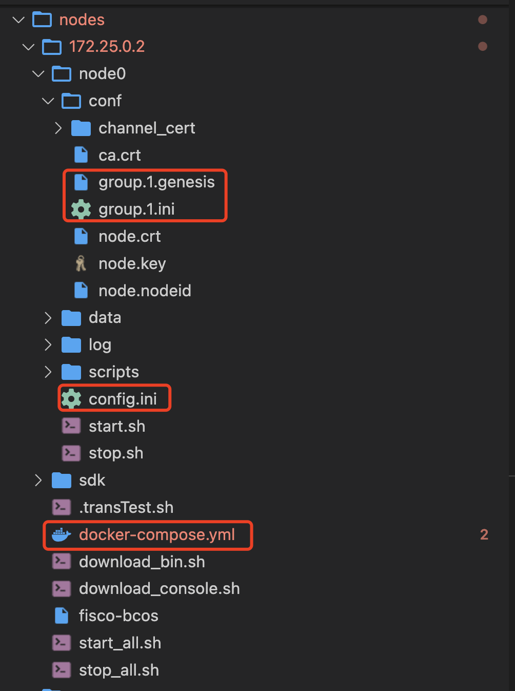

# Docker-Compose 部署fisco和webase
二次封装build_chain脚本，针对无外网条件下建链,自动生成Docker-compose编排脚本文件。

支持以下特性:
* 修改配置文件动态新增服务器和节点，平滑扩容
* 修改配置文件动态新增分组，无需通过console控制台
* 动态生成编排的Docker-compose文件


## 1.搭建区块链网络
```bash
docker network create -d bridge --subnet=172.25.0.0/16 --gateway=172.25.0.1 fisco_network
```

## 2.新建三节点
```bash
[fisco]
#国密
gm=0
#单机模拟多台机器
debug=1
output=./nodes
nodes=server1 server2 server3

[server1]
ip=172.25.0.2
num=1
agencyName=agency
groups=1
ports=30300,20200,8545

[server2]
ip=172.25.0.3
num=1
agencyName=agency
groups=1
ports=30300,20200,8545

[server3]
ip=172.25.0.4
num=1
agencyName=agency
groups=1
ports=30300,20200,8545
```

## 3.生成节点配置并启动节点
```bash
./build.sh
cd nodes/172.25.0.2 && docker-compose up -d && cd ../172.25.0.3 && docker-compose up -d && cd ../172.25.0.4 && docker-compose up -d
```

## 4.查看状态和共识
```bash
tail -f nodes/172.25.0.2/node0/log/log*  | grep connected
tail -f nodes/172.25.0.2/node0/log/log*  | grep +++
```

## 5.新增节点和分组，修改config.ini
```bash
修改nodes
nodes=server1 server2 server3 server4 server5

新增
[server4]
ip=172.25.0.5
num=1
agencyName=agency
groups=2 3
ports=30300,20200,8545

[server5]
ip=172.25.0.6
num=1
agencyName=agency
groups=2 3
ports=30300,20200,8545
```
## 6.重新生成配置文件,启动新节点
```bash
./build.sh
cd nodes/172.25.0.5 && docker-compose up -d && cd ../172.25.0.6 && docker-compose up -d
```

## 7.查看追加节点状态和共识
```bash
tail -f nodes/172.25.0.5/node0/log/log*  | grep connected
tail -f nodes/172.25.0.5/node0/log/log*  | grep +++
```


